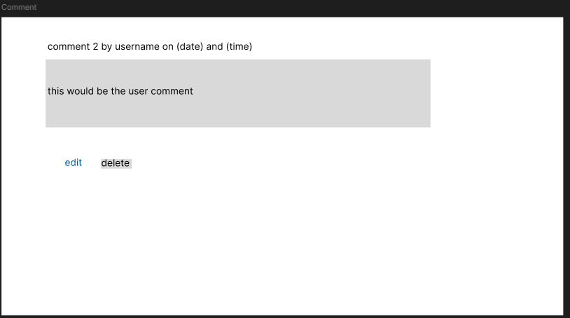
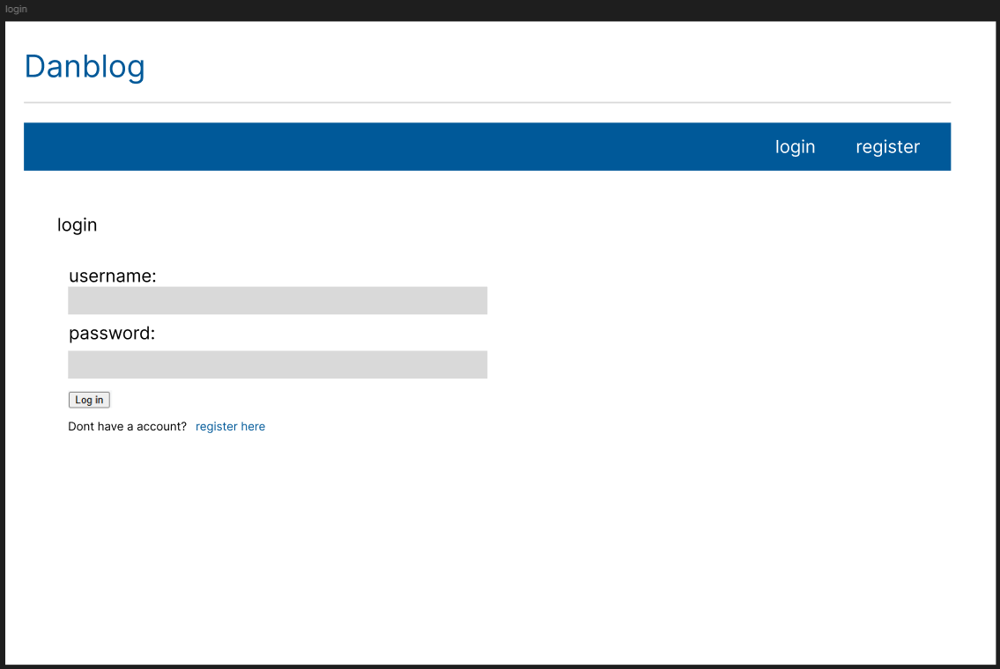
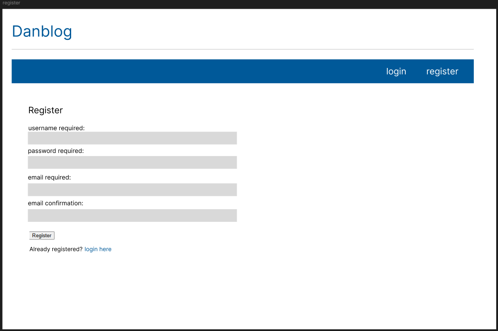
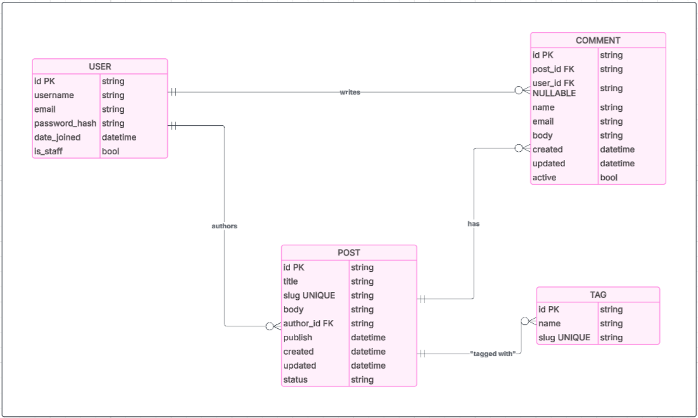
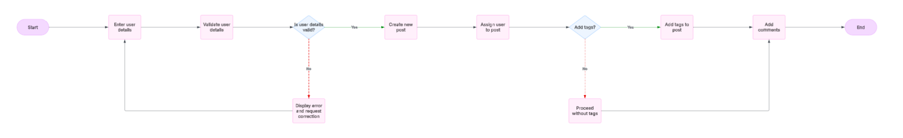
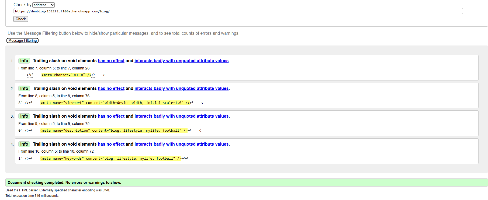
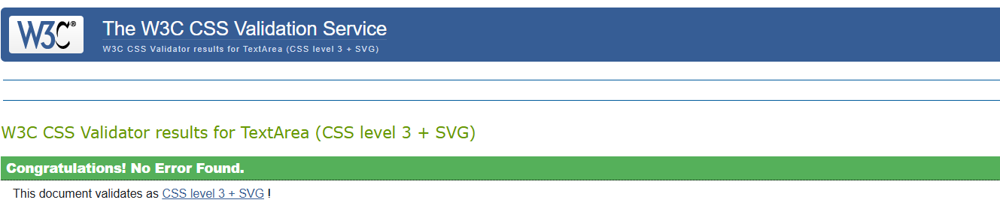
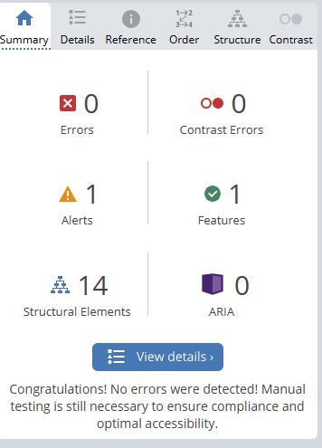
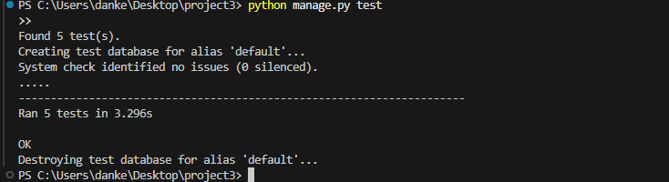

# DansBlog

[Welcome to DansBlog](https://danblog-1322f2bf100e.herokuapp.com/)


DansBlog is a responsive, accessible blogging platform built to showcase my Django development skills while meeting a real need for a simple, user-friendly blog with comment moderation.

## CONTENTS

* [User Experience](#user-experience)
  * [Project Goals](#project-goals)
  * [User Stories](#user-stories)

* [Design](#design)
  * [Colour Scheme](#colour-scheme)
  * [Typography](#typography)
  * [Imagery](#imagery)
  * [Wireframes](#wireframes)
  * [Database Schema](#database-schema)

* [Features](#features)
  * [Elements Found on Each Page](#elements-found-on-each-page)
  * [Future Implementations](#future-implementations)
  * [Accessibility](#accessibility)

* [Technologies Used](#technologies-used)
  * [Languages Used](#languages-used)
  * [Databases Used](#databases-used)
  * [Frameworks Used](#frameworks-used)
  * [Libraries & Packages Used](#libraries--packages-used)
  * [Programs Used](#programs-used)

* [Deployment & Local Development](#deployment--local-development)
  * [Deployment](#deployment)
  * [Local Development](#local-development)
    * [How to Fork](#how-to-fork)
    * [How to Clone](#how-to-clone)

* [Testing](#testing)

* [Credits](#credits)
  * [Code Used](#code-used)
  * [Content](#content)
  * [Media](#media)
  * [Acknowledgments](#acknowledgments)

---

## User Experience

### Project Goals

Project Goals
The rationale behind DansBlog is to create a responsive, secure, and easy-to-use blogging platform that enables post sharing, discussion, and moderation, while demonstrating my ability to design, build, and deploy a full-stack Django application.

The need:
Many blogging platforms are either overly complex for small personal projects or lack the flexibility to implement custom features like comment editing, tagging, or moderation. For this milestone, I wanted to create a streamlined alternative—something easy for both readers and content creators, while giving me full control over the features.

Why this project is valuable:

It combines core Django skills: models, views, templates, forms, authentication, and deployment.

It uses a real-world use case, a functional blog with CRUD operations for both posts and comments.

It is fully responsive and accessible, catering to users across devices and abilities.

It is scalable, allowing for new features such as image uploads, like systems, or advanced search.

How DansBlog solves the problem:

A minimal, distraction-free design makes reading and navigating posts simple.

CRUD functionality for comments ensures readers can contribute and manage their own content.

Tag filtering helps users quickly find relevant topics.

The admin panel gives site owners full control over posts, tags, and comments.

Security best practices (CSRF tokens, authentication checks, and permissions) are applied to protect data.

This project is both a portfolio piece and a practical tool, demonstrating my capability to turn an idea into a live, maintainable web application.

### User Stories

#### Target Audience

People around the world who know me and want to stay updated on what I’m doing.

#### First Time Visitor Goals

As a first time user of the site I want to be able to:
1. Land on the homepage and see a clean list of blog posts with titles, summaries, and dates.
2. Click on a post to view full content and comments.
3. Navigate to other posts via similar post suggestions.
4. If interested, leave a comment by registering as a user typing a comment and clicking "Submit Comment".
5. Can use the browser’s back or main navigation to explore more posts.

#### Returning Visitor Goals

As a returning registered user of the site I want to be able to:

1. Visit the site directly or through a shared link.
2. Navigate to specific posts to read updates or new content.
3. Read through existing comments and adds their own via the comment form.
4. Choose to share a post using the “Share this post” feature, filling in an email form.
5. Engage regularly as the blog is updated with new content.


#### Admin User

As an administrator for the site I want to be able to:

1. Log into the Django admin panel using secure credentials.
2. View and manages all Posts, Comments, Tags, and Users via the default admin UI.
3. Add, edit, or delete posts as necessary.
4. Moderate comments by reviewing or removing content that violates community guidelines (manual moderation).
5. Plan to implement additional moderation tools in future iterations.


## Design

### Colour Scheme

I have taken inspiration from the header image for the colour palette and chosen colours that complement each other. My colour choices came from my love of using Reddit!


### Typography

-Dansblog uses two main system fonts to ensure fast loading and broad compatibility:

Helvetica (with a fallback to sans-serif) is used for the body text. It's clean, modern, and highly readable—ideal for accessibility across all devices.

Georgia (with a serif fallback) is applied to post dates, displayed in italic to give a classic and refined look that contrasts nicely with the main content.

These fonts help maintain a balance between readability and visual appeal.

### Imagery

As the site is for my blog, I have kept the imagery throughout the site to the theme of simple and non intrusive. Please view the media section for more information on where each image was sourced.

### Wireframes

Wireframes were created for mobile, tablet and desktop using figma.
<br>
Displays the blog title, navigation, and a list of published posts with titles, summaries, and links.

<br>
Displays the blog title, navigation, and a list of published posts with titles, summaries, and links. And a selected blog post.

<br>
Default Django admin interface, showing models such as Posts, Comments, Tags, and Users.

<br>
Responsive layout of the homepage, with posts stacked vertically and a compact header.

<br>
Responsive layout of the homepage, with posts stacked vertically, a compact header, and a selected blog post.

<br>
Default Django admin interface, showing models such as Posts, Comments, Tags, and Users.

<br>
A clean layout with name, email, and body fields stacked above a submit button.

<br>
A clean layout showing how a comment appears including edit and delete button.

<br>
a screenshot of edit comment section.

<br>
a screeshot for my login page for regular users.

<br>
registration page.

### Database Schema

#### First Draft

| Model   | Fields | Relationships |
|---------|--------|---------------|
| Post    | title, slug, body, publish, etc. | FK to User |
| Comment | name, email, body, active, etc. | FK to Post |
| User    | Django User | — |

#### Final Schema

mermaid
<br>

flowchart
<br>


## Features

Dansblog offers a clear and minimal blogging experience, where users can browse, read, and comment on posts. The design is clean and responsive, prioritising readability and usability on both desktop and mobile devices.

### Elements Found on Each Page

**Navigation Bar**
- Available on all pages.
- Includes links to the homepage and other key sections.
- Fixed at the top for easy access.

**Homepage**
- Displays a list of published posts with title, author, date, and a brief excerpt.
- “Read more” links direct users to full posts.

**Post Detail Page**
- Displays full blog content formatted with Markdown.
- Shows author, date, and associated tags.
- Lists similar posts for easy navigation.
- Includes a comment section where users can view and submit comments.

**Comment Section**
- Users can leave a comment by registering an account.
- Comments display the name, date, and message content.
- Submitted comments are immediately visible if active.

**Admin Panel**
- Admin users can manage posts, comments, users, and tags.
- Built on Django’s default admin interface.
- Posts can be created, edited, or deleted from the admin dashboard.

### Future Implementations
- **Comment Moderation Workflow**: Add approval flow before comments are published.
- **Post Categories**: Organise posts by category for better filtering.
- **Search Functionality**: Enable keyword-based search across blog content.
- **Pagination Controls**: Refine post listing navigation.
- **Image Uploads**: Let users attach images to posts or comments.
- **Like / Reaction System**: Enable readers to engage with posts more interactively.
- **Tag Filtering**: Click on tags to view all posts with the same tag.
- **404 / Custom Error Pages**: Improve feedback for invalid routes.

### Accessibility

DansBlog follows basic accessibility principles to ensure a usable experience for all users:

- Semantic HTML elements are used for structure (e.g., `main`, `article`, `nav`).
- Font choices prioritise readability with sufficient contrast.
- Form fields have associated labels for screen readers.
- The site layout adapts to all screen sizes with responsive design.
- Submit buttons and links are fully keyboard-accessible.
- Clear heading hierarch

## Technologies Used

### Languages Used

- **Python** – Backend logic and Django framework.
- **HTML5** – Markup language for templates and structure.
- **CSS3** – Styling and layout.
- **JavaScript** – For basic frontend interactivity.

### Databases Used

- **SQLite3** – Default database used during local development.
- **PostgreSQL** – Production database used on Heroku.

### Frameworks Used

- **Django** – Full-stack Python web framework.
- **Gunicorn** – WSGI HTTP server for serving Django on Heroku.

### Libraries & Packages Used

- **Django Taggit** – Enables tagging functionality for posts.
- **Markdown** – Allows rich formatting of blog post content.
- **Django Markdownify** – Renders markdown safely in templates.
- **django-crispy-forms** – Improves form rendering and layout.
- **psycopg2** – PostgreSQL adapter for Python.
- **Whitenoise** – Serves static files in production.
- **dj-database-url** – Parses database URLs for environment configs.
- **python-dotenv** – Manages environment variables.
- **gunicorn** – Web server used in deployment.

### Programs Used

- **VS Code** – Code editor used throughout development.
- **Git** – Version control system.
- **GitHub** – Repository hosting and collaboration.
- **Heroku** – Cloud platform used to deploy the project.
- **Google Chrome DevTools** – For inspecting layout and testing responsiveness.
- **Figma** - For creating wireframes.
- **w3 validation** - for validating my html code and css
- **wave** - for checking my accessibility


---

## Deployment & Local Development

### Deployment (Heroku)

This project was deployed using [Heroku](https://www.heroku.com/) with the following configuration:

- **Heroku stack:** container (buildpack-based)
- **Web server:** Gunicorn
- **Database:** PostgreSQL (provisioned via Heroku Add-ons)
- **Static files:** Managed using Whitenoise
- **Environment variables:** Managed with Heroku Config Vars

1. Push to GitHub
2. Create Heroku app
3. Connect repo
4. Add buildpack: `heroku/python`
5. Set config vars:
   - SECRET_KEY
   - DEBUG
   - ALLOWED_HOSTS
   - DATABASE_URL
6. Add PostgreSQL add-on
7. Run:
```bash
heroku run python manage.py migrate
heroku run python manage.py createsuperuser
heroku run python manage.py collectstatic
```
8. Visit live URL

### Local Development

1. Clone repo
2. Create virtual environment:
```bash
python3 -m venv venv
source venv/bin/activate
```
3. Install dependencies:
```bash
pip install -r requirements.txt
```
4. Add `.env` file
5. Run:
```bash
python manage.py migrate
python manage.py createsuperuser
python manage.py runserver
```
6. Visit `http://127.0.0.1:8000/blog/`

### How to Fork

Log into GitHub and navigate to the DansBlog repository.

Click the Fork button (top-right corner).

This will create a copy of the repository in your own GitHub account.

### How to Clone

1. On your forked repository page, click the Code button.
2. Copy the URL under HTTPS.
3. Open your terminal and run:
  bash
  git clone https://github.com/your-username/dansblog.git
4. Navigate into the directory:
  bash
  cd dansblog

You now have a local copy of the project to work with.

## Testing

### Manual Testing


W3 validator<br>
<br>
html validation
<br>
css validation
lighthouse score<br>
<br>
The score is almost perfect, lighthouse says the colours dont contrast enough<br>
Wave test<br>
<br>
The alert is for a redundant link, however it does work and is relevent
python test<br>
<br>


Testing
1. - **Manual Feature Testing**
Feature	Test Action	Expected Result	Pass
Create Comment	Fill in form, submit	Comment appears instantly under correct post	✅<br>
Edit Comment	Click Edit, change text, save	Updated text displays correctly	✅<br>
Delete Comment	Click Delete, confirm	Comment removed from post	✅<br>
Register / Login	Fill in registration form, log in	User account created and logged in	✅<br>
Permission Check	Try to edit/delete another user's comment	Action blocked, 403 Forbidden page shown	✅<br>
Tag Filtering	Click on a post tag	List shows only posts with that tag	✅<br>
Search Posts	Enter keyword in search form	Relevant posts displayed in search results	✅<br>
Post Share via Email	Submit share form with valid details	Email is sent successfully	✅<br>
Pagination	Navigate to next/previous pages	Correct posts displayed per page	✅<br>

2. - **Responsiveness Testing**
Tested using Chrome DevTools and physical devices:

Mobile: iPhone 14, iPhone SE, Samsung Galaxy S22

Tablet: iPad Air, Samsung Galaxy Tab

Desktop: 1080p and 1440p monitors

✅ Layout adapts with no horizontal scroll, text remains readable, and buttons are finger-friendly on touch devices.
<br>

3. - **Accessibility Testing**
Tool	Result	Notes
WAVE	✅	Only redundant link warning (by design)<br>
Lighthouse	95+	Minor colour contrast warning (blue link updated)<br>
Manual Keyboard Test	✅	Full keyboard navigation works<br>
Screen Reader Check	✅	Labels, headings, and alt text present<br>

Accessibility principles applied:

Semantic HTML<br>
Form inputs have label tags.<br>
High-contrast text where possible.<br>
Buttons and links are reachable via Tab key.<br>
<br>

4. - **Code Validation**
HTML: W3C Markup Validator – Passed with no critical errors.<br>
CSS: W3C CSS Validator – Passed.<br>
Python: Flake8 – Checked for syntax errors and PEP8 compliance.<br>
<br>

5. - **Cross-Browser Testing**
Browser	Result<br>
Chrome (latest)	✅<br>
Firefox	✅<br>
Edge	✅<br>
Safari (iOS)	✅<br>
<br>

6. - **Automated Testing**
Tests written in tests.py for models and views:<br>

Post model returns correct string and URL.<br>

Comment model orders comments by creation date.<br>

Views return expected templates and status codes.<br>

Permission tests ensure only owners/staff can edit/delete comments.<br>

Run locally with:

bash
Copy
Edit
python manage.py test
<br>

7. - **Bug Fix Log**
Issue	Resolution<br>
Static files not loading on Heroku	Added Whitenoise and STATIC_ROOT config<br>
Comments submitted without name/email	Added form validation and error display<br>
Non-owners could see edit/delete buttons	Added template condition checks<br>
Contrast warning for links	Updated blue from #0079d3 to #005999<br>
Submit button beside name field	Rendered fields separately in template<br>


## Credits

### Code Used

- This project was based on the example blog project from the book **"Django 5 by Example"** by Antonio Mele, used for learning and reference.
- Tagging functionality was implemented using the [`django-taggit`](https://django-taggit.readthedocs.io/en/latest/) package.
- Markdown rendering uses Django’s `markdown` filter for formatting post content.
- Some utility code and layout ideas were adapted from tutorials by [Real Python](https://realpython.com/), [MDN Web Docs](https://developer.mozilla.org/en-US/), and [Django documentation](https://docs.djangoproject.com/).

### Content

- All blog post content is original and written by me for testing purposes.
- Placeholder names, emails, and form data used in testing were invented for demonstration and have no relation to real individuals.

### Media

- Wireframes were generated using [Figma](https://www.figma.com/)
- Color palette was chosen to match the aesthetic inspired by Reddit.
- Icons and default favicons were sourced from [Font Awesome](https://fontawesome.com/).

### Acknowledgments

- Thanks to the **Code Institute** for providing the structure, guidance, and marking criteria for this project.
- Special thanks to **Spencer** and **Jessica** for being absolute diamonds and reassuring me I can do this!
- Special thanks to the **Django community** for their excellent documentation and support.
- Thanks to **Antonio Mele** for his Django book, which was instrumental in shaping this blog.
- Finally, thank you to **friends and family** who tested the site and gave feedback during development.
