# DansBlog

[Welcome to DansBlog](https://danblog-1322f2bf100e.herokuapp.com/)

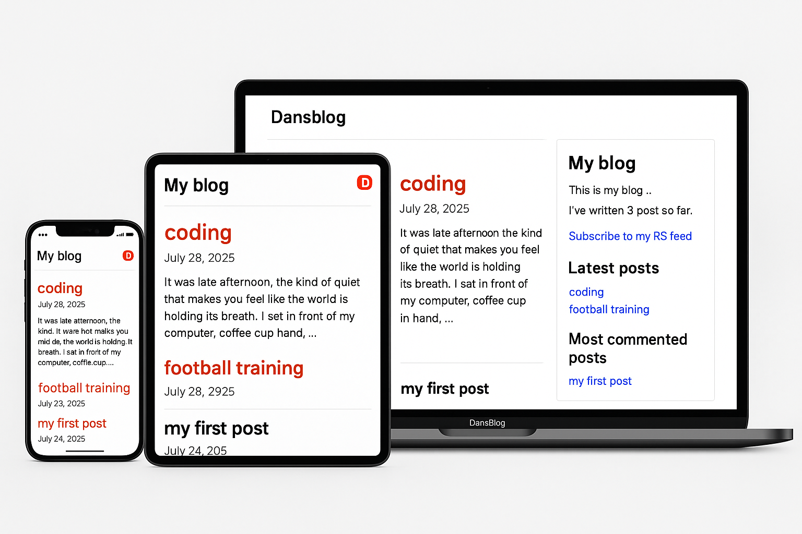

DansBlog was created as my third milestone project for the Code Institute’s Level 5 Diploma in Web Application Development. The project demonstrates a simple, personal blog built using Django, with CRUD functionality for comments, tag filtering, and admin control.

## CONTENTS

* [User Experience](#user-experience)
  * [Project Goals](#project-goals)
  * [User Stories](#user-stories)

* [Design](#design)
  * [Colour Scheme](#colour-scheme)
  * [Typography](#typography)
  * [Imagery](#imagery)
  * [Wireframes](#wireframes)
  * [Database Schema](#database-schema)

* [Features](#features)
  * [Elements Found on Each Page](#elements-found-on-each-page)
  * [Future Implementations](#future-implementations)
  * [Accessibility](#accessibility)

* [Technologies Used](#technologies-used)
  * [Languages Used](#languages-used)
  * [Databases Used](#databases-used)
  * [Frameworks Used](#frameworks-used)
  * [Libraries & Packages Used](#libraries--packages-used)
  * [Programs Used](#programs-used)

* [Deployment & Local Development](#deployment--local-development)
  * [Deployment](#deployment)
  * [Local Development](#local-development)
    * [How to Fork](#how-to-fork)
    * [How to Clone](#how-to-clone)

* [Testing](#testing)

* [Credits](#credits)
  * [Code Used](#code-used)
  * [Content](#content)
  * [Media](#media)
  * [Acknowledgments](#acknowledgments)

---

## User Experience

### Project Goals

The goal of the DansBlog project is to create a personal blogging platform where I can share posts, ideas, and updates in a simple and organized way. I built DansBlog to apply and demonstrate the skills I've learned in Django development, including working with models, views, templates, and admin customization. This project helps me understand the fundamentals of building a dynamic website and serves as a foundation for more complex web applications in the future.

### User Stories

#### Target Audience

People around the world who know me and want to stay updated on what I’m doing.

#### First Time Visitor Goals

As a first time user of the site I want to be able to:
1. Lands on the homepage and sees a clean list of blog posts with titles, summaries, and dates.
2. Clicks on a post to view full content and comments.
3. May navigate to other posts via similar post suggestions.
4. If interested, leaves a comment by filling out the name, email, and body fields and clicking "Submit Comment".
5. Can use the browser’s back or main navigation to explore more posts.

#### Returning Visitor Goals

As a returning registered user of the site I want to be able to:

1. Visits the site directly or through a shared link.
2. Navigates to specific posts to read updates or new content.
3. Reads through existing comments and adds their own via the comment form.
4. May choose to share a post using the “Share this post” feature, filling in an email form.
5. Engages regularly as the blog is updated with new content.


#### Admin User

As an administrator for the site I want to be able to:

1. Logs into the Django admin panel using secure credentials.
2. Views and manages all Posts, Comments, Tags, and Users via the default admin UI.
3. Adds, edits, or deletes posts as necessary.
4. Moderates comments by reviewing or removing content that violates community guidelines (manual moderation).
5. Plans to implement additional moderation tools in future iterations.


## Design

### Colour Scheme

I have taken inspiration from the header image for the colour palette and chosen colours that complement each other. My colour choices came from my love of using reddit!
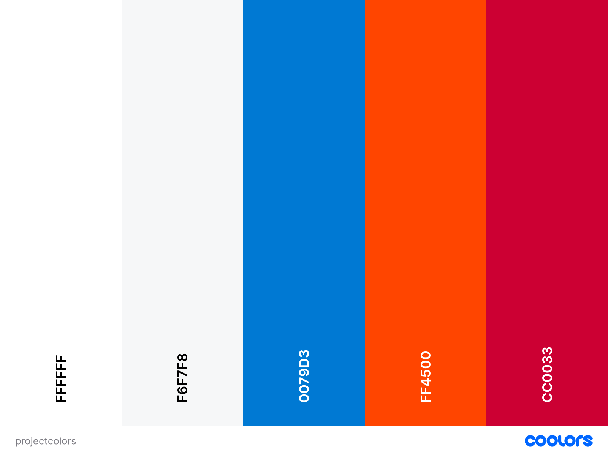

### Typography

-DansBlog uses two main system fonts to ensure fast loading and broad compatibility:

Helvetica (with a fallback to sans-serif) is used for the body text. It's clean, modern, and highly readable—ideal for accessibility across all devices.

Georgia (with a serif fallback) is applied to post dates, displayed in italic to give a classic and refined look that contrasts nicely with the main content.

These fonts help maintain a balance between readability and visual appeal.

### Imagery

As the site is for my blog, I have kept the imagery throughout the site to the theme of simple and non intrusive. Please view the media section for more information on where each image was sourced.

### Wireframes

Wireframes were created for mobile, tablet and desktop using figma.
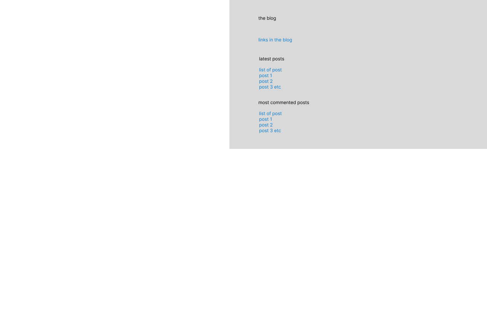<br>
Displays the blog title, navigation, and a list of published posts with titles, summaries, and links.

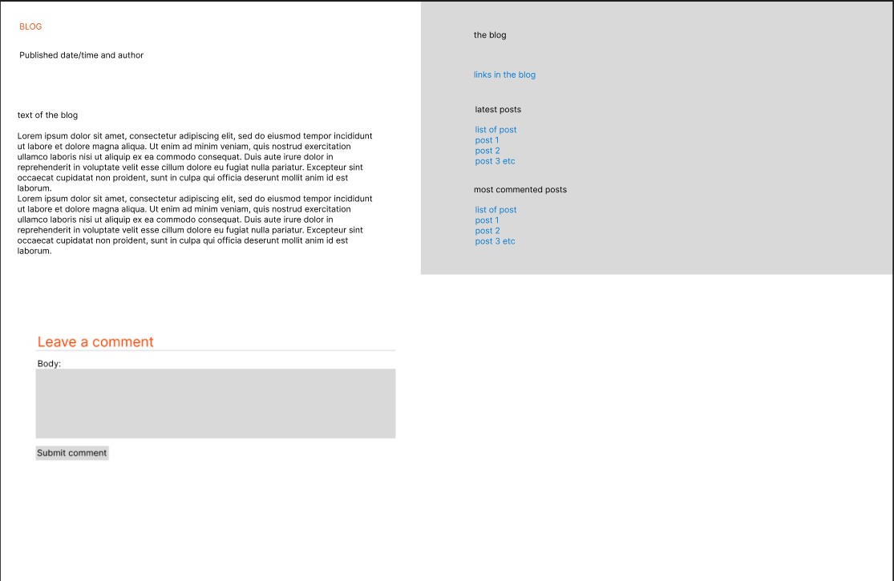<br>
Displays the blog title, navigation, and a list of published posts with titles, summaries, and links. And a selected blog post.

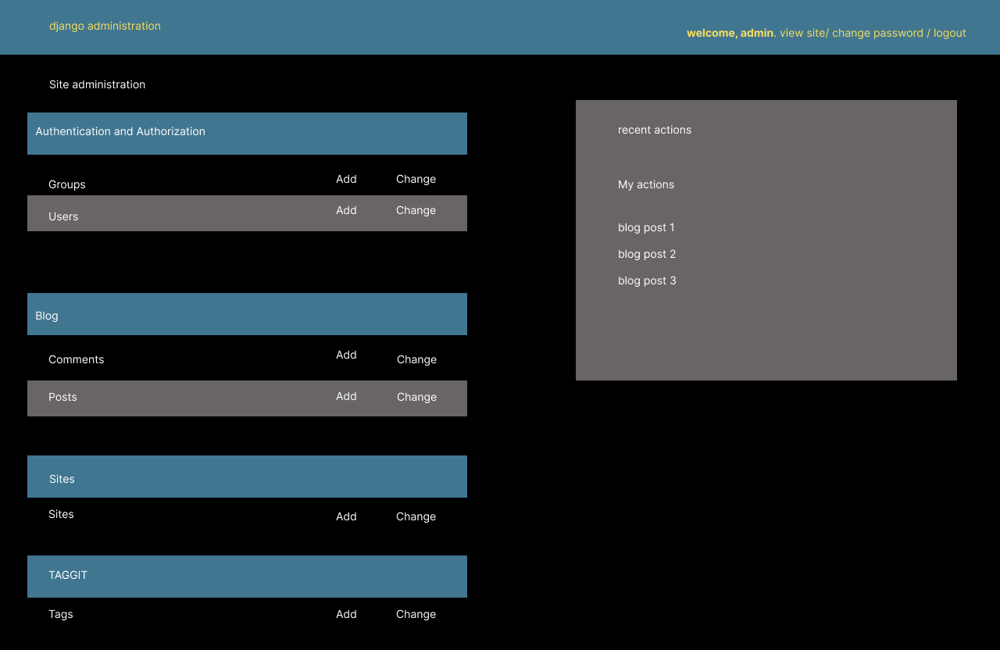<br>
Default Django admin interface, showing models such as Posts, Comments, Tags, and Users.

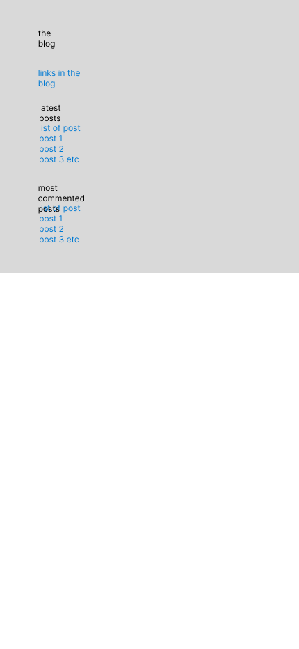<br>
Responsive layout of the homepage, with posts stacked vertically and a compact header.

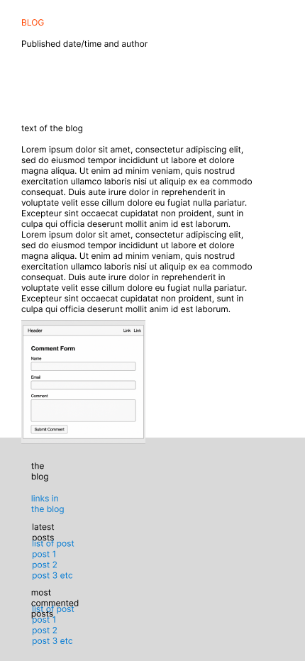<br>
Responsive layout of the homepage, with posts stacked vertically and a compact header, And a selected blog post.

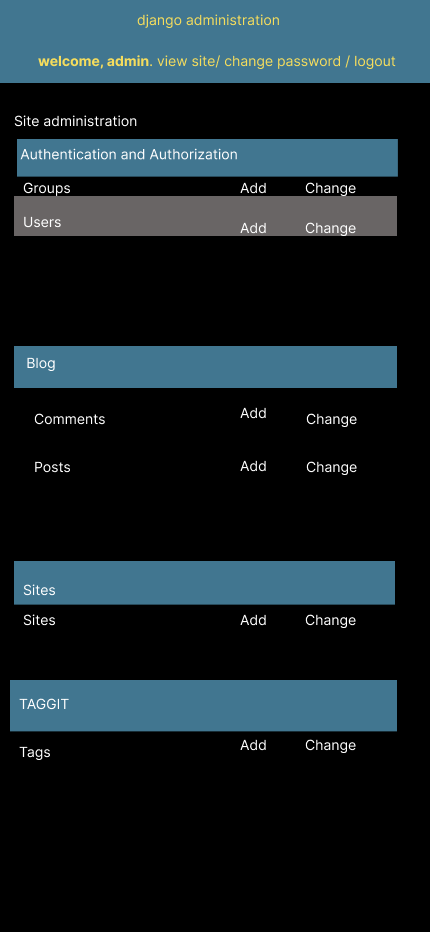<br>
Default Django admin interface, showing models such as Posts, Comments, Tags, and Users.

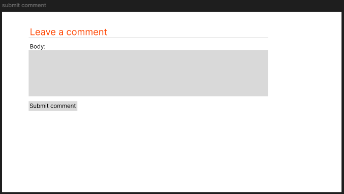<br>
A clean layout with name, email, and body fields stacked above a submit button.

### Database Schema

#### First Draft

| Model   | Fields | Relationships |
|---------|--------|---------------|
| Post    | title, slug, body, publish, etc. | FK to User |
| Comment | name, email, body, active, etc. | FK to Post |
| User    | Django User | — |

#### Final Schema

mermaid
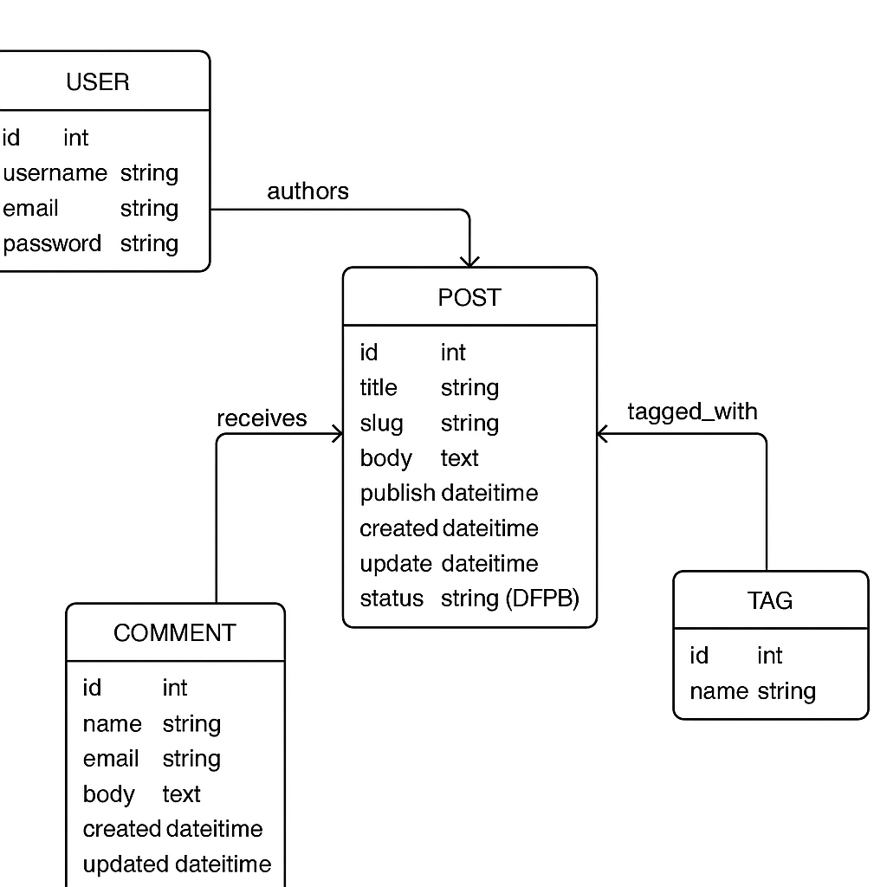

## Features

DansBlog offers a clear and minimal blogging experience, where users can browse, read, and comment on posts. The design is clean and responsive, prioritizing readability and usability on both desktop and mobile devices.

### Elements Found on Each Page

**Navigation Bar**
- Available on all pages.
- Includes links to the homepage and other key sections.
- Fixed at the top for easy access.

**Homepage**
- Displays a list of published posts with title, author, date, and a brief excerpt.
- “Read more” links direct users to full posts.

**Post Detail Page**
- Displays full blog content formatted with Markdown.
- Shows author, date, and associated tags.
- Lists similar posts for easy navigation.
- Includes a comment section where users can view and submit comments.

**Comment Section**
- Users can leave a comment by entering their name, email, and message.
- Comments display the name, date, and message content.
- Submitted comments are immediately visible if active.

**Admin Panel**
- Admin users can manage posts, comments, users, and tags.
- Built on Django’s default admin interface.
- Posts can be created, edited, or deleted from the admin dashboard.

### Future Implementations

- **User Registration & Login**: Allow users to create accounts and log in.
- **Comment Moderation Workflow**: Add approval flow before comments are published.
- **Post Categories**: Organize posts by category for better filtering.
- **Search Functionality**: Enable keyword-based search across blog content.
- **Pagination Controls**: Refine post listing navigation.
- **Image Uploads**: Let users attach images to posts or comments.
- **Like / Reaction System**: Enable readers to engage with posts more interactively.
- **Tag Filtering**: Click on tags to view all posts with the same tag.
- **404 / Custom Error Pages**: Improve feedback for invalid routes.

### Accessibility

DansBlog follows basic accessibility principles to ensure a usable experience for all users:

- Semantic HTML elements are used for structure (e.g., `<main>`, `<article>`, `<nav>`).
- Font choices prioritize readability with sufficient contrast.
- Form fields have associated labels for screen readers.
- The site layout adapts to all screen sizes with responsive design.
- Submit buttons and links are fully keyboard-accessible.
- Clear heading hierarch

## Technologies Used

### Languages Used

- **Python** – Backend logic and Django framework.
- **HTML5** – Markup language for templates and structure.
- **CSS3** – Styling and layout.
- **JavaScript** – For basic frontend interactivity.

### Databases Used

- **SQLite3** – Default database used during local development.
- **PostgreSQL** – Production database used on Heroku.

### Frameworks Used

- **Django** – Full-stack Python web framework.
- **Gunicorn** – WSGI HTTP server for serving Django on Heroku.

### Libraries & Packages Used

- **Django Taggit** – Enables tagging functionality for posts.
- **Markdown** – Allows rich formatting of blog post content.
- **Django Markdownify** – Renders markdown safely in templates.
- **django-crispy-forms** – Improves form rendering and layout.
- **psycopg2** – PostgreSQL adapter for Python.
- **Whitenoise** – Serves static files in production.
- **dj-database-url** – Parses database URLs for environment configs.
- **python-dotenv** – Manages environment variables.
- **gunicorn** – Web server used in deployment.

### Programs Used

- **VS Code** – Code editor used throughout development.
- **Git** – Version control system.
- **GitHub** – Repository hosting and collaboration.
- **Heroku** – Cloud platform used to deploy the project.
- **Google Chrome DevTools** – For inspecting layout and testing responsiveness.
- **Figma** - For creating wireframes.

---

## Deployment & Local Development

### Deployment (Heroku)

This project was deployed using [Heroku](https://www.heroku.com/) with the following configuration:

- **Heroku stack:** container (buildpack-based)
- **Web server:** Gunicorn
- **Database:** PostgreSQL (provisioned via Heroku Add-ons)
- **Static files:** Managed using Whitenoise
- **Environment variables:** Managed with Heroku Config Vars

1. Push to GitHub
2. Create Heroku app
3. Connect repo
4. Add buildpack: `heroku/python`
5. Set config vars:
   - SECRET_KEY
   - DEBUG
   - ALLOWED_HOSTS
   - DATABASE_URL
6. Add PostgreSQL add-on
7. Run:
```bash
heroku run python manage.py migrate
heroku run python manage.py createsuperuser
heroku run python manage.py collectstatic
```
8. Visit live URL

### Local Development

1. Clone repo
2. Create virtual environment:
```bash
python3 -m venv venv
source venv/bin/activate
```
3. Install dependencies:
```bash
pip install -r requirements.txt
```
4. Add `.env` file
5. Run:
```bash
python manage.py migrate
python manage.py createsuperuser
python manage.py runserver
```
6. Visit `http://127.0.0.1:8000/blog/`

### How to Fork

Log into GitHub and navigate to the DansBlog repository.

Click the Fork button (top-right corner).

This will create a copy of the repository in your own GitHub account.

### How to Clone

1. On your forked repository page, click the Code button.
2. Copy the URL under HTTPS.
3. Open your terminal and run:
  bash
  git clone https://github.com/your-username/dansblog.git
4. Navigate into the directory:
  bash
  cd dansblog

You now have a local copy of the project to work with.

## Testing

### Manual Testing

- Navigation works on all screen sizes
- Posts render correctly
- Comments validate
- Share form emails
- Admin actions (CRUD) work

lighthouse score
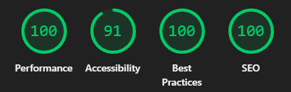<br>
The score is almost perfect, lighthouse says the colours dont contrast enough


### Responsiveness

Tested with DevTools at mobile/tablet/desktop breakpoints

### Accessibility

- Labels for all fields
- Semantic headings
- Good contrast

### Bugs & Fixes

| Issue | Resolution |
| Submit button appeared next to name input | Updated template to render form fields manually |
| Hover color not applying to links | Added explicit CSS rules for `a:hover` |
| Static files not loading on Heroku | Added `Whitenoise` and configured `STATIC_ROOT` |
| Comments submitted without name/email | Added form validation and error display |

### Automated Testing

Basic tests were added to validate models and views:

- `Post` model tested for correct string output and URL generation.
- `Comment` model tested for creation and ordering.
- Views tested for correct template rendering and status codes.

Tests were run using:

bash
python manage.py test

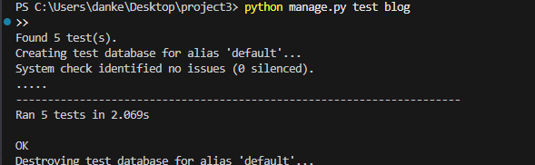

### Live Testing


## Credits

### Code Used

- This project was based on the example blog project from the book **"Django 5 by Example"** by Antonio Mele, used for learning and reference.
- Tagging functionality was implemented using the [`django-taggit`](https://django-taggit.readthedocs.io/en/latest/) package.
- Markdown rendering uses Django’s `markdown` filter for formatting post content.
- Some utility code and layout ideas were adapted from tutorials by [Real Python](https://realpython.com/), [MDN Web Docs](https://developer.mozilla.org/en-US/), and [Django documentation](https://docs.djangoproject.com/).

### Content

- All blog post content is original and written by me for testing purposes.
- Placeholder names, emails, and form data used in testing were invented for demonstration and have no relation to real individuals.

### Media

- Wireframes were generated using 
- Color palette was chosen to match the aesthetic inspired by Reddit.
- Icons and default favicons were sourced from .

### Acknowledgments

- Thanks to the **Code Institute** for providing the structure, guidance, and marking criteria for this project.
- Special thanks to **Spencer** and **Jessica** for being absolute diamonds and reassuring me i can do this!
- Special thanks to the **Django community** for their excellent documentation and support.
- Thanks to **Antonio Mele** for his Django book, which was instrumental in shaping this blog.
- Finally, thank you to **friends and family** who tested the site and gave feedback during development.
